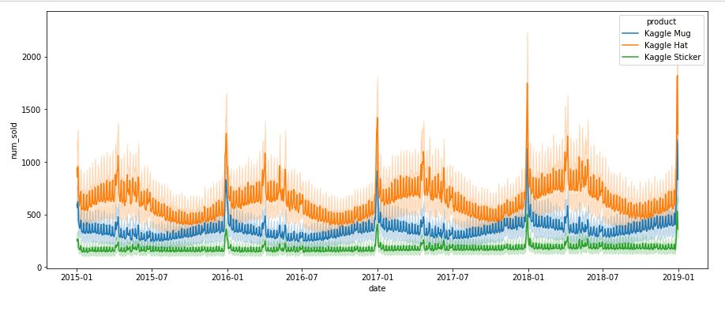
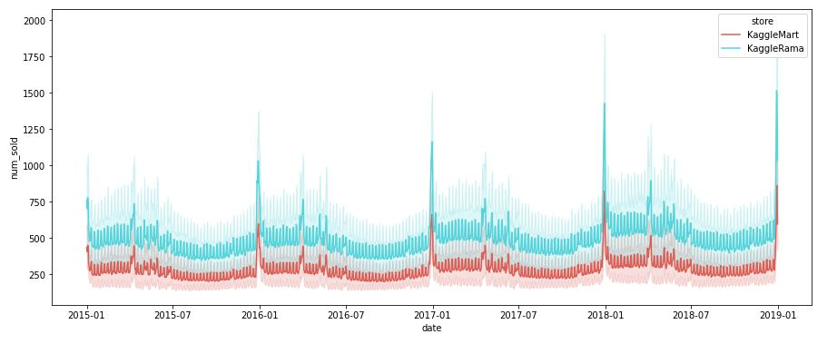
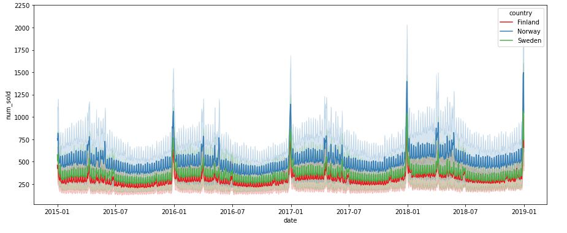
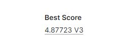
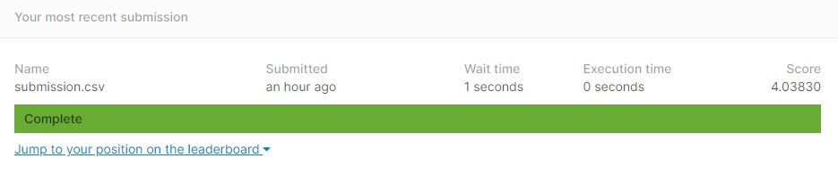
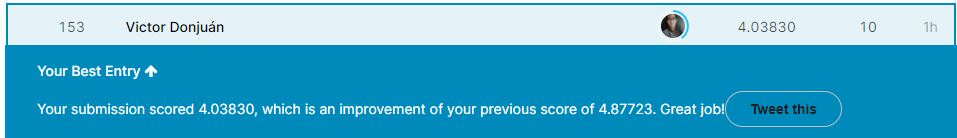

Jupyter Notebooks:

First Attempt: Linear Regression

Second Attempt: CatBoost Regressor with Pycaret 

# Forecasting Sales (TPS Jan 2022 Kaggle Competition): Overview

In this short project, we attempt to get good scores in the popular Tabular Playground Series Competition from Kaggle, which this time consists of a Forecasting Sales Problem. As usual in Kaggle Competitions, we dataset is divided into two datasets:

- train: 26,298 observations, with a response variable.
- test: 6,570 observations, without a response variable.

The features are: 

- date (every day from January 2015 to December 2019)
- country (Finland, Norway and Sweden) 
- product (Kaggle Mug, Kaggle Hat and Kaggle Sticker) 
- store (KaggleMart and KaggleRama). 
 
Although fictional, the dataset contains actual trends from the Nordic Countries. In fact, in this project we performed Feature Engineering by joining two external sets: the GDP of the Nordic Countries and the Holidays in the Nordic Countries in order to get the trends and seasonality of the sales.

# First Attempt

For the first attempt at getting a good score, I've used the GDP per capita from the Nordic Countries, for every year from 2015 to 2018. We built a Linear Multiplicative Regression (a Linear Regression with a transformed response variable via the natural logarithm). The following score was obtained:

Although this is not a bad score, it was just among the 20% best scores. In the next attempt, we wanted to improve this.

# Second Attempt

For the second attempt, we tried using a CatBoost Regressor with the Library Pycaret. Pycaret is fairly recent library in Python which seeks to perform Machine Learning with just a few code lines. In this attempt, we further performed Feature Engineering by having into account the Festivities from the Nordic Countries. This got us a much better score in the Kaggle Competition:

With this score we achieve 153rd place out of 1429 participants, which means among the 11% best scores in the competition.
